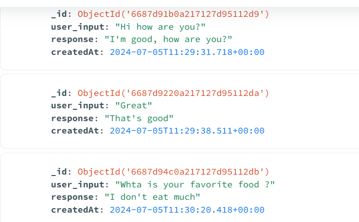
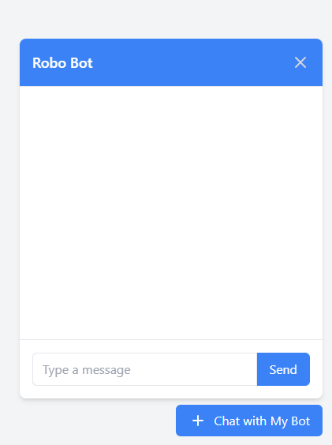
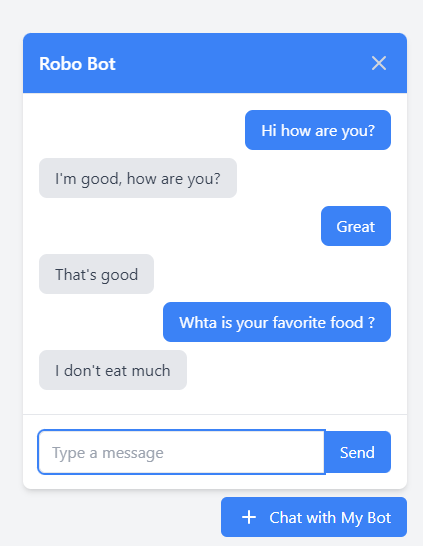

# 🤖 ChatBot Project

This project is a chatbot developed using modern technologies such as HuggingFace, Flask, MongoDB, and Tailwind CSS. The goal is to create an interactive chatbot that can store conversations and provide intelligent responses to user queries.

## 🛠️ Technologies Used

- **Python**: Main language for developing the backend of the ChatBot.
- **HuggingFace**: To utilize pre-trained language models, specifically the `microsoft/DialoGPT-medium` model in this initial phase.
- **MongoDB**: Database for storing conversations, history, and in a future phase user data.
- **Flask**: Python framework for developing the ChatBot API.
- **JavaScript/Tailwind CSS**: For the ChatBot frontend.
- **Docker**: To containerize the application and facilitate deployment.
- **Deploy**:  Find a free platform to deploy the backend and database.

## 📈 Project Progress

### 🛠️ Environment Setup
- [x] Configuration of the virtual environment in Python.
- [x] Installation of necessary dependencies (HuggingFace, Flask, pymongo, etc.).

### 🚀 Backend Development
- [x] Implementation of the API with Flask.
- [x] Configuration of HuggingFace to use a pre-trained language model.
- [x] Creation of endpoints to receive user messages and respond using the language model.
- [X] Connection with MongoDB to store and retrieve conversations.
- [X] Implementation of a TTL index in MongoDB to delete conversations after 24 hours.

#### Sample data in MongoDB Atlas

### 🎨 Frontend Development
- [X] Creation of a user interface with Tailwind CSS where users can interact with the ChatBot.
- [X] Configuration of API calls to send and receive messages.

#### User Interface of the ChatBot

#### Interaction with the ChatBot

### 📦 Deployment
- [X] Dockerization of the application to facilitate deployment.
- [ ] Deployment of the application.
- [ ] Configuration of MongoDB to be accessible from the deployed application.

### 🔍 Testing and Continuous Improvement
- [ ] Conducting extensive tests to ensure the ChatBot responds correctly.
- [ ] Adding additional features such as context recognition, improvements in UI design, etc.

## 💻 How to Run the Project
### 🔧 Prerequisites
- Python 3.9
- Node.js and npm
- Docker and Docker Compose
  
### 📜 Instructions

### 🐳 Docker Configuration

### 🌟 Future Improvements
### 🤝 Contributions
Contributions are welcome. Please open an issue or a pull request to discuss what you would like to change.

## 📜 Licencia

This project is licensed under the MIT License.

---

Made with ❤️ by [CarPeAs](https://github.com/CarPeAs) 
